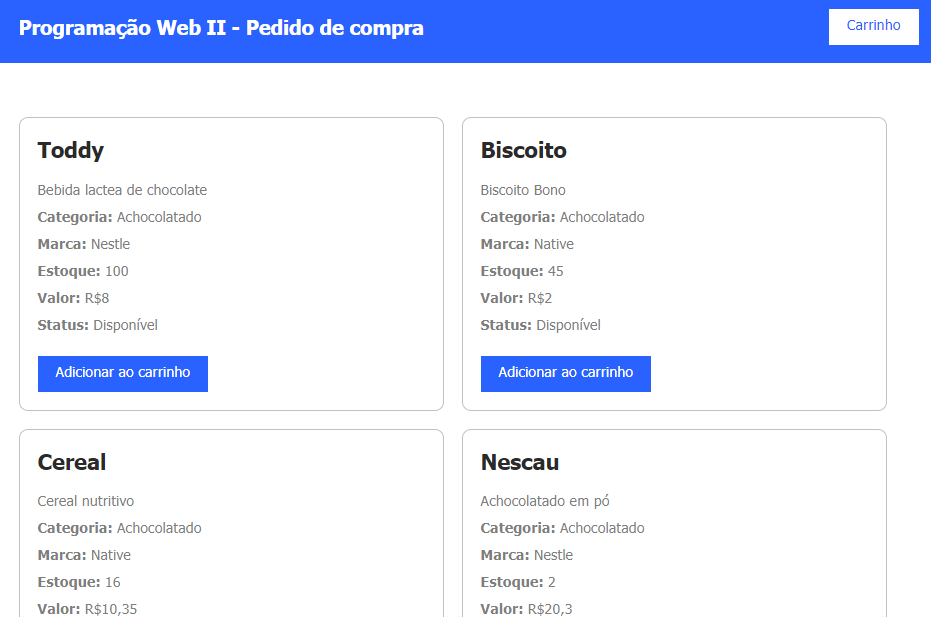
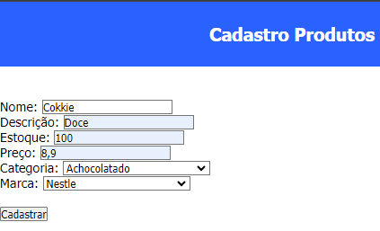
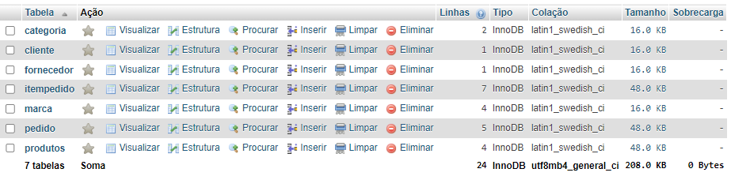

# Projeto de Cadastro Ecommerce

Este projeto é um sistema de cadastro de produtos, marcas e categorias para um ecommerce. Ele também inclui a funcionalidade de visualizar o carrinho de compras. O sistema foi desenvolvido utilizando PHP e MySQL, com interface em HTML e CSS.

## Funcionalidades

- **Cadastro de Produtos**: Permite adicionar novos produtos ao sistema.

- **Cadastro de Marcas**: Permite adicionar novas marcas ao sistema.

- **Cadastro de Categorias**: Permite adicionar novas categorias ao sistema.

- **Visualização do Carrinho**: Exibe os produtos adicionados ao carrinho.

## Estrutura do Projeto

O projeto está organizado nos seguintes arquivos principais:!

- `carrinho.php`
- `categoria.php`
- `index.php`
- `insere-categoria.php`
- `insere-marca.php`
- `insere-produto.php`
- `marca.php`
- `pedido.php`
- `produtos.php`

Além dos arquivos secundários, JS, Model, CSS e controller.

### carrinho.php

Este arquivo é responsável por exibir o conteúdo do carrinho de compras. Ele inclui o arquivo `controller/carrinho-busca.php`, que busca e exibe os produtos no carrinho.

### categoria.php

Este arquivo é usado para cadastrar novas categorias de produtos. Ele contém um formulário que envia os dados para `insere-categoria.php` via método POST.

### index.php

Este arquivo é a página inicial que exibe os produtos disponíveis. Ele inclui o arquivo `controller/produtos-busca.php`, que busca e exibe os produtos.

### insere-categoria.php

Este arquivo processa o formulário de cadastro de categorias e insere os dados no banco de dados. Ele verifica se o formulário foi enviado, valida os dados e insere uma nova categoria no banco de dados.

### insere-marca.php

Este arquivo processa o formulário de cadastro de marcas e insere os dados no banco de dados. Ele verifica se o formulário foi enviado, valida os dados e insere uma nova marca no banco de dados.

### insere-produto.php

Este arquivo processa o formulário de cadastro de produtos e insere os dados no banco de dados. Ele recebe os dados enviados pelo formulário, insere o novo produto no banco de dados e redireciona para a página de produtos com uma mensagem de sucesso ou erro.

### marca.php

Este arquivo é usado para cadastrar novas marcas de produtos. Ele contém um formulário que envia os dados para `insere-marca.php` via método POST.

### pedido.php

Este arquivo exibe o resumo do pedido. Ele inclui o arquivo `controller/produtos-resumo.php`, que busca e exibe o resumo dos produtos do pedido.

### produtos.php

Este arquivo é usado para cadastrar novos produtos. Ele contém um formulário que envia os dados para `insere-produto.php` via método POST e popula os selects de categoria e marca com dados do banco de dados.

## Ferramentas Utilizadas

Para rodar este projeto, utilizamos o XAMPP e o phpMyAdmin para gerenciar o banco de dados. Certifique-se de ter estas ferramentas instaladas e configuradas corretamente.

## Imagens da Aplicação Banco de Dados

### Estrutura do Banco de Dados



## Comentários no Código

Os códigos PHP foram comentados para explicar as funcionalidades implementadas. Por exemplo, em `insere-...php` que mostra como validar no banco de dados:

```php
// Verificar se o formulário foi submetido
if ($_SERVER['REQUEST_METHOD'] == 'POST') {
    $descricao = $_POST['descricao'];

    // Validar os dados de entrada
    if (empty($descricao)) {
        echo "<h3>Erro: Descrição é obrigatória!</h3><br><br>";
    } else {
        // Inserir dados no banco de dados
        $cad_categoria = "INSERT INTO categoria (DESCRICAO) VALUES ('$descricao')";
        if (mysqli_query($mysqli, $cad_categoria)) {
            echo "<h1>Categoria Cadastrada com Sucesso!</h1><br>";
        } else {
            echo "Erro: ". mysqli_error($mysqli). "<br>";
        }
    }
}

mysqli_close($mysqli); ```

